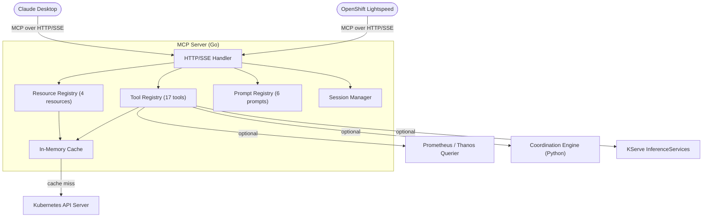
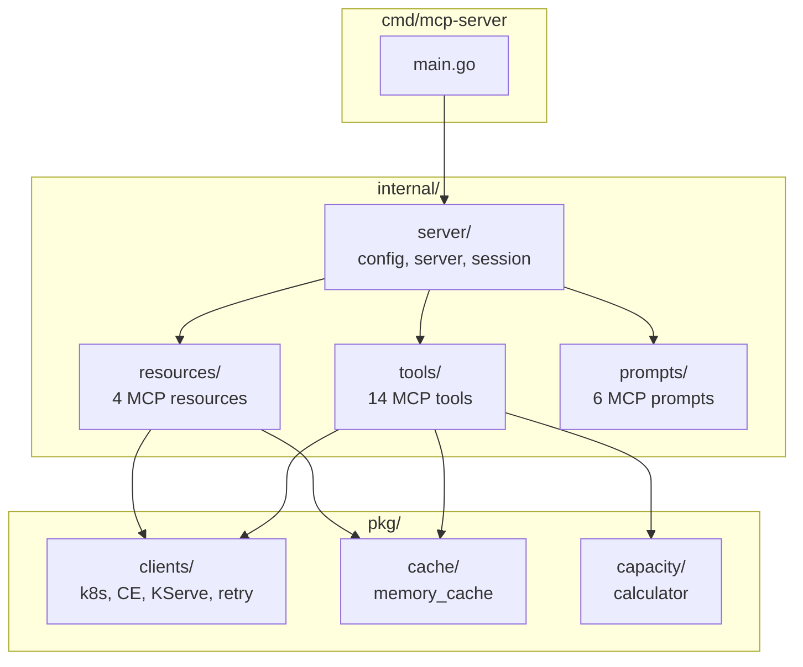
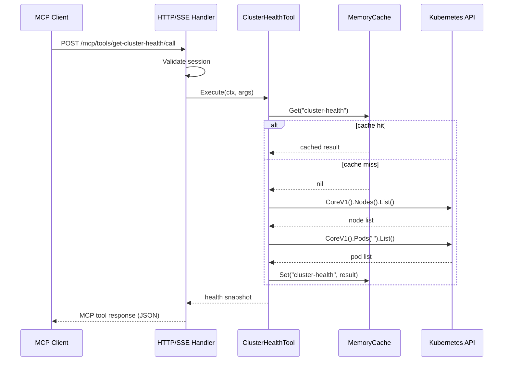
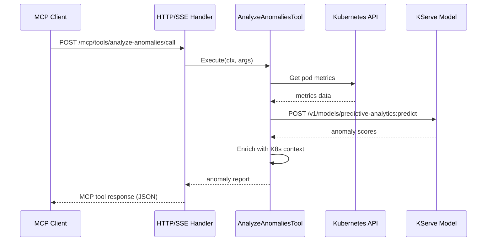
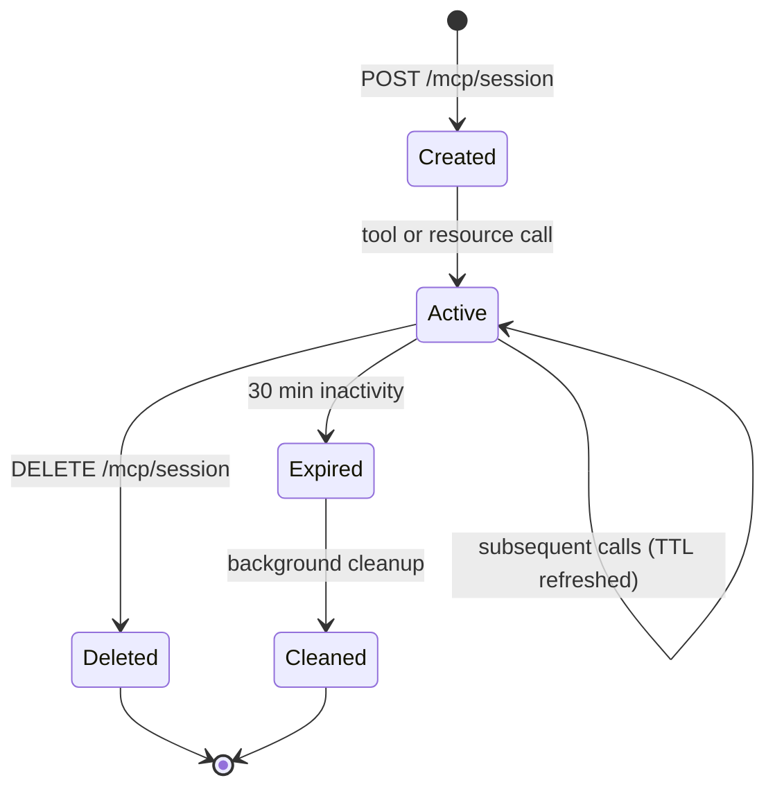
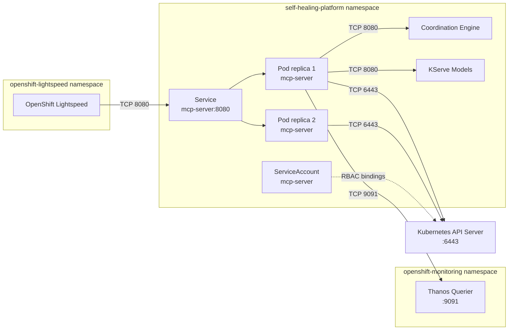

# DESIGN_DOC.md

**System:** OpenShift Cluster Health MCP Server
**Version:** 0.2.0
**Status:** Accepted
**Audience:** Architects, implementers, reviewers, SRE teams
**Voice:** STE100
**Related requirements:** [CLAUDE.md](CLAUDE.md), [docs/adrs/](docs/adrs/)

---

## 1. Introduction and goals

The OpenShift Cluster Health MCP Server is a Go service that exposes OpenShift cluster health data through the Model Context Protocol (MCP). It enables AI assistants (OpenShift Lightspeed, Claude Desktop) to query cluster state, detect anomalies, and trigger remediation workflows using natural language.

The server acts as a bridge between MCP clients and four backend systems: the Kubernetes API, Prometheus, an optional Coordination Engine, and optional KServe ML models. It translates MCP tool and resource requests into API calls, caches results to reduce backend load, and returns structured responses that AI assistants can reason over.

### 1.1 Quality goals

| ID | Goal | Scenario |
|----|------|----------|
| QG-1 | Low latency | Tool responses complete in less than 100 ms at the 95th percentile. |
| QG-2 | Minimal footprint | Memory usage stays below 50 MB at rest. Container image is below 50 MB. |
| QG-3 | Stateless operation | Any replica can handle any request. Pod restarts cause no data loss. |
| QG-4 | Graceful degradation | Optional integrations (CE, KServe, Prometheus) fail without blocking core K8s tools. |

### 1.2 Stakeholders

| Stakeholder | Expectation |
|-------------|-------------|
| SRE / Platform Engineer | Query cluster health through natural language via OpenShift Lightspeed. |
| AI Assistant (Lightspeed) | Invoke MCP tools and read MCP resources to answer user questions. |
| ML Engineer | Check KServe model status and anomaly detection results. |
| Architect | Understand the system decomposition, ADRs, and extension points. |

---

## 2. Constraints

**Business constraints:**
- Ship value with existing Python Coordination Engine and KServe services. Do not block on a full-stack rewrite.
- Support a rolling 3-version window of OpenShift releases (currently 4.20, 4.21, 4.22).

**Technical constraints:**
- Language: Go 1.24+ ([ADR-001](docs/adrs/001-go-language-selection.md)).
- MCP SDK: Official `github.com/modelcontextprotocol/go-sdk` ([ADR-002](docs/adrs/002-official-mcp-go-sdk-adoption.md)).
- Transport: HTTP/SSE only. stdio is deprecated ([ADR-004](docs/adrs/004-transport-layer-strategy.md)).
- Storage: No persistent database. In-memory cache only ([ADR-005](docs/adrs/005-stateless-design.md)).
- Container: Distroless UBI 9 Micro base image ([ADR-008](docs/adrs/008-distroless-container-images.md)).

**Legal and security constraints:**
- Run as non-root with read-only filesystem ([ADR-007](docs/adrs/007-rbac-based-security-model.md)).
- RBAC: read-only ClusterRole. No write access to cluster resources.
- OpenShift restricted-v2 SCC compliance.

---

## 3. Context and scope

The MCP server sits between MCP clients and the OpenShift platform services. It exposes tools (active operations), resources (passive data), and prompts (reusable templates) through a single HTTP/SSE endpoint.

**In scope:**
- MCP protocol handling (tools, resources, prompts, sessions)
- Kubernetes cluster health queries (nodes, pods, namespaces)
- Anomaly detection via KServe integration
- Incident management via Coordination Engine integration
- In-memory caching with TTL

**Out of scope:**
- ML model training or retraining
- Persistent incident storage (delegated to Coordination Engine)
- Prometheus query language (PromQL) execution (Phase 3, not implemented)
- Direct cluster mutation (write operations)



---

## 4. Solution strategy

The design rests on five high-level choices. Each is documented as an ADR.

| Choice | ADR | Rationale |
|--------|-----|-----------|
| Go as the implementation language | [ADR-001](docs/adrs/001-go-language-selection.md) | Native client-go, single binary, small container image. |
| Official MCP Go SDK | [ADR-002](docs/adrs/002-official-mcp-go-sdk-adoption.md) | Protocol compliance, maintained by Anthropic. |
| HTTP/SSE transport only | [ADR-004](docs/adrs/004-transport-layer-strategy.md) | Required for OpenShift Lightspeed integration. |
| Stateless design, no database | [ADR-005](docs/adrs/005-stateless-design.md) | Horizontal scaling, operational simplicity, 12-factor compliance. |
| Optional integrations via feature flags | [ADR-006](docs/adrs/006-integration-architecture.md) | Coordination Engine, KServe, and Prometheus are all optional. |

---

## 5. Building block view

The server decomposes into seven packages. The `internal/` packages hold application logic. The `pkg/` packages hold reusable library code.

| Building block | Package | Responsibility |
|----------------|---------|----------------|
| Server core | `internal/server/` | HTTP routing, MCP SDK integration, session management, configuration. |
| MCP tools | `internal/tools/` | 17 tools that perform active operations (query, analyze, trigger). |
| MCP resources | `internal/resources/` | 4 resources that expose passive, cacheable data. |
| MCP prompts | `internal/prompts/` | 6 prompt templates for common AI assistant workflows. |
| API clients | `pkg/clients/` | Kubernetes, Coordination Engine, KServe HTTP clients with retry logic. |
| Cache | `pkg/cache/` | In-memory TTL cache with background cleanup. |
| Capacity | `pkg/capacity/` | Pod capacity calculator for namespace and cluster planning. |



### 5.1 Directory tree

```text
openshift-cluster-health-mcp/
  cmd/
    mcp-server/          # Entry point (main.go)
    healthcheck/         # Liveness probe binary
    k8s-demo/            # Demo client
  internal/
    server/              # HTTP server, MCP protocol, sessions
      config.go          # Environment-based configuration
      server.go          # Core server with tool/resource registration
      session.go         # Session manager (30-min TTL)
    tools/               # 17 MCP tool implementations
      cluster_health.go         get-cluster-health
      list_pods.go              list-pods
      calculate_pod_capacity.go calculate-pod-capacity
      list_adrs.go              list-adrs
      analyze_anomalies.go      analyze-anomalies
      predict_resource_usage.go predict-resource-usage
      analyze_scaling_impact.go analyze-scaling-impact
      list_incidents.go         list-incidents
      create_incident.go        create-incident
      trigger_remediation.go    trigger-remediation
      get_remediation_recommendations.go get-remediation-recommendations
      get_throttled_pods.go     get-throttled-pods
      predict_disk_exhaustion.go predict-disk-exhaustion
      get_rightsizing_recommendations.go get-rightsizing-recommendations
      investigate_rca.go        investigate-rca
      model_status.go           get-model-status
      list_models.go            list-models
    resources/           # 4 MCP resource implementations
      cluster_health.go  cluster://health (10s TTL)
      nodes.go           cluster://nodes (30s TTL)
      incidents.go       cluster://incidents (5s TTL)
      remediation_history.go cluster://remediation-history (30s TTL)
      remediation_history.go cluster://remediation-history
    prompts/             # 6 MCP prompt templates
  pkg/
    clients/
      kubernetes.go      # K8s client (in-cluster or kubeconfig)
      coordination_engine.go  # CE REST client
      kserve.go          # KServe prediction client
      retry.go           # Retry with exponential backoff
    cache/
      memory_cache.go    # TTL cache with background cleanup
    capacity/
      calculator.go      # Pod capacity calculations
  charts/
    openshift-cluster-health-mcp/  # Helm chart
  docs/
    adrs/                # 14 Architecture Decision Records
  deploy/
    kubernetes/          # Raw K8s manifests
```

### 5.2 MCP tools

| Tool | Backend | Cached | Description |
|------|---------|--------|-------------|
| `get-cluster-health` | K8s API | Yes (10s) | Cluster health snapshot: node and pod counts, status. |
| `list-pods` | K8s API | No | Pod listing with namespace and status filters. |
| `calculate-pod-capacity` | K8s API | No | Namespace or cluster pod capacity planning. |
| `list-adrs` | GitHub API | Yes (5m) | CE ADR index with optional status filter. |
| `list-incidents` | CE | No | Active incidents from Coordination Engine. |
| `create-incident` | CE | No | Create a new incident in Coordination Engine. |
| `trigger-remediation` | CE | No | Automated remediation with OOMKill memory patching. |
| `get-remediation-recommendations` | CE | No | ML-powered remediation recommendations. |
| `predict-resource-usage` | CE | No | Time-specific CPU/memory forecasting with capacity forecast. |
| `analyze-scaling-impact` | CE | No | Replica scaling impact analysis. |
| `get-throttled-pods` | CE | No | Pods with high CPU throttling (CFS metrics). |
| `predict-disk-exhaustion` | CE | No | Disk usage trend prediction with urgency classification. |
| `get-rightsizing-recommendations` | CE | No | Per-container CPU/memory right-sizing via P95 usage. |
| `investigate-rca` | CE | No | Deep root-cause analysis correlating pod events, NetworkPolicy, Istio. |
| `analyze-anomalies` | CE + KServe | No | ML-based anomaly detection with enriched signals. |
| `get-model-status` | KServe | Yes (20s) | KServe InferenceService health. |
| `list-models` | KServe | Yes (20s) | List available KServe models. |

---

## 6. Runtime view

### 6.1 Get cluster health (cached path)

This sequence shows the most common flow: a cached tool invocation that avoids a Kubernetes API call.



### 6.2 Analyze anomalies (multi-backend)

This sequence shows a tool that calls both the Kubernetes API and an external KServe model.



### 6.3 Session lifecycle

HTTP sessions have a 30-minute TTL. A background goroutine cleans expired sessions every minute.



---

## 7. Deployment view

The server deploys as a Helm chart into an OpenShift namespace. Two replicas run behind a ClusterIP Service. The container image uses a distroless UBI 9 Micro base.



**Runtime details:**
- Container image: `quay.io/takinosh/openshift-cluster-health-mcp:ocp-4.22-latest`
- Resources: 64 Mi request, 128 Mi limit (memory). 50m request, 200m limit (CPU).
- Probes: `/health` endpoint for liveness (30s interval) and readiness (10s interval).
- Security: `allowPrivilegeEscalation: false`, all capabilities dropped, `restricted-v2` SCC.
- Secrets: ServiceAccount token for K8s API and Prometheus authentication.

---

## 8. Crosscutting concepts

**Caching.** The `pkg/cache/memory_cache.go` module provides a TTL-based in-memory cache. Each pod maintains its own independent cache. There is no cross-replica synchronization. Default TTL is 30 seconds. Background cleanup runs every minute. Tools choose caching based on data volatility: cluster health is cached, pod listings are not.

**RBAC and security.** [ADR-007](docs/adrs/007-rbac-based-security-model.md) defines the security model. A dedicated ServiceAccount holds a read-only ClusterRole for nodes, pods, events, namespaces, deployments, and StatefulSets. A namespace-scoped Role grants read access to KServe InferenceServices. NetworkPolicies restrict ingress to the OpenShift Lightspeed namespace.

**Error handling.** The `pkg/clients/retry.go` module provides retry logic with exponential backoff. Tool errors propagate to the MCP SDK, which converts them into MCP error responses. Context cancellation is respected in all long operations.

**Configuration.** All configuration is environment-variable based (`internal/server/config.go`). No configuration files are read. This follows the 12-factor app model.

**Feature flags.** Three optional integrations are controlled by environment variables:
- `ENABLE_COORDINATION_ENGINE` + `COORDINATION_ENGINE_URL`
- `ENABLE_KSERVE` + `KSERVE_NAMESPACE`
- `ENABLE_PROMETHEUS` + `PROMETHEUS_URL`

Each defaults to `false`. Tools that depend on a disabled integration return a clear error message.

**Extensibility.** New tools follow a standard interface: implement `Name()`, `Description()`, `InputSchema()`, and `Execute()`. Register in `internal/server/server.go:registerTools()`. New resources follow the same pattern with a `Read()` method.

---

## 9. Architectural decisions

The project maintains 14 Architecture Decision Records in `docs/adrs/`.

| ADR | Title | Status |
|-----|-------|--------|
| [ADR-001](docs/adrs/001-go-language-selection.md) | Go language selection | Implemented |
| [ADR-002](docs/adrs/002-official-mcp-go-sdk-adoption.md) | Official MCP Go SDK adoption | Implemented |
| [ADR-003](docs/adrs/003-standalone-mcp-server-architecture.md) | Standalone MCP server architecture | Implemented |
| [ADR-004](docs/adrs/004-transport-layer-strategy.md) | Transport layer strategy (HTTP/SSE only) | Implemented |
| [ADR-005](docs/adrs/005-stateless-design.md) | Stateless design, no database | Implemented |
| [ADR-006](docs/adrs/006-integration-architecture.md) | Integration architecture (optional backends) | Implemented |
| [ADR-007](docs/adrs/007-rbac-based-security-model.md) | RBAC-based security model | Implemented |
| [ADR-008](docs/adrs/008-distroless-container-images.md) | Distroless container images | Implemented |
| [ADR-009](docs/adrs/009-architecture-evolution-roadmap.md) | Architecture evolution roadmap | Implemented |
| [ADR-010](docs/adrs/010-version-compatibility-upgrade-roadmap.md) | Version compatibility and upgrade roadmap | Implemented |
| [ADR-011](docs/adrs/011-argocd-mco-integration-boundaries.md) | ArgoCD/MCO integration boundaries | Implemented |
| [ADR-012](docs/adrs/012-non-argocd-application-remediation.md) | Non-ArgoCD application remediation | Implemented |
| [ADR-013](docs/adrs/013-multi-layer-coordination-engine.md) | Multi-layer Coordination Engine | Implemented |
| [ADR-014](docs/adrs/014-branch-protection-strategy.md) | Branch protection strategy | Implemented |

---

## 10. Quality requirements

| ID | Requirement | Risk | Verify |
|----|-------------|------|--------|
| NFR-001 | Tool response latency below 100 ms at p95 | Medium | Load test: 200 requests per minute for 1 hour. |
| NFR-002 | Memory usage below 50 MB at rest | Low | Observe `container_memory_usage_bytes` in Prometheus. |
| NFR-003 | Container image below 50 MB | Low | CI check: `docker inspect --format='{{.Size}}'`. |
| NFR-004 | Startup time below 1 second | Low | Measure in CI with `time ./bin/mcp-server &; curl /health`. |
| NFR-005 | Cache hit rate above 70% for repeated queries | Medium | Monitor `mcp_cache_hits_total / (hits + misses)`. |
| NFR-006 | Zero critical or high CVEs in container image | High | Trivy scan in CI pipeline. |
| NFR-007 | Pod restart causes no data loss | Low | Restart pod, verify tools respond correctly. |

---

## 11. Risks and technical debt

| Risk / Debt | Impact | Owner | Mitigation |
|-------------|--------|-------|------------|
| k8s.io dependency versions not aligned across release branches ([#125](https://github.com/KubeHeal/openshift-cluster-health-mcp/issues/125)) | Medium | Platform team | Align per-branch or amend ADR-010 to drop per-branch pinning. |
| MCP Go SDK 4 minor versions behind (v1.2.0 vs v1.6.0) ([#124](https://github.com/KubeHeal/openshift-cluster-health-mcp/issues/124)) | Medium | Platform team | Impact assessment, then merge Dependabot PRs. |
| No published GitHub releases ([#126](https://github.com/KubeHeal/openshift-cluster-health-mcp/issues/126)) | Low | Release lead | Create v0.1.0 release from existing tag. |
| Go version 2 minor versions behind (1.24 vs 1.26 available) ([#128](https://github.com/KubeHeal/openshift-cluster-health-mcp/issues/128)) | Low | Platform team | Assess Go 1.26 compatibility, update toolchain. |
| Coordination Engine Go rewrite (ADR-009 Phase 2) deferred | Low | Architect | Acceptable. Current HTTP integration works. Re-evaluate if latency becomes an issue. |
| Prometheus integration not implemented (Phase 3) | Low | Platform team | Tools that need Prometheus return a clear "not enabled" message. |

---

## 12. Glossary

| Term | Meaning |
|------|---------|
| MCP | Model Context Protocol. An open standard by Anthropic for AI assistant integration with external tools and data. |
| SSE | Server-Sent Events. A unidirectional HTTP streaming protocol used for MCP transport. |
| client-go | The official Kubernetes Go client library (`k8s.io/client-go`). |
| KServe | A Kubernetes-native platform for ML model serving. Runs InferenceServices as pods. |
| Coordination Engine (CE) | A Python/Flask service that manages incident workflows, remediation, and state in PostgreSQL. |
| SCC | Security Context Constraint. An OpenShift mechanism that restricts pod security settings. |
| RBAC | Role-Based Access Control. Kubernetes authorization mechanism using Roles and RoleBindings. |
| ADR | Architecture Decision Record. A document that captures a significant architectural choice. |
| TTL | Time to Live. The duration a cache entry remains valid before expiration. |
| Distroless | A minimal container image that contains only the application binary and its runtime dependencies. |
| arc42 | A template for documenting software architecture in twelve sections. |
| Helm | A package manager for Kubernetes that uses charts (templates) to define deployments. |
| OCP | OpenShift Container Platform. Red Hat's enterprise Kubernetes distribution. |
| Thanos Querier | A Prometheus-compatible query frontend used in OpenShift monitoring. |
